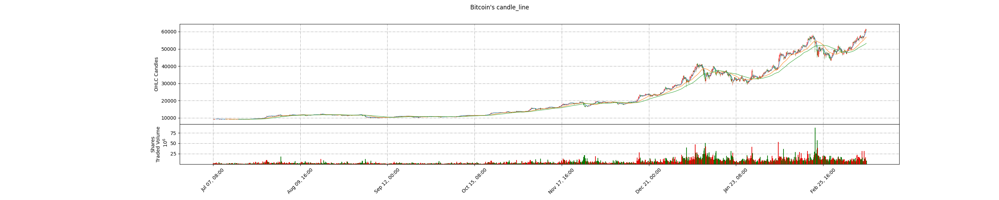

[English](./README.md) |  [简体中文](./README.zh-CN.md) | 繁體中文
#Bitcoin~GPU 虚拟货币矿潮对GPU的影响以及社会反响

###這是我組的資料探勘報告，意在研究2008~2021年之間挖礦導致的計算晶元緊缺問題

##研究步驟

- 1、發掘探勘比特幣BTC、以太幣ETH 2009~2021價格。
- 2、發掘探勘GPU在2014~2021里的價格（以GTX1060，GTX1660ti，RTX2060，RTX3060作為主要研究對象）。
- 3、將上兩者做數據分析，並制出相應圖表（這一部分我會再做更多的思考 考慮如何得出更多有必要的內容）。
- 4、同時，查找2014~2021每一年與挖礦相關的熱詞（游戲玩家、礦工、吃瓜群眾等多方面的評價），並製作熱點詞雲 。
- 5、另外，如果可以/缺乏內容，我們再加入對於比特幣熱點BTH（另一種虛擬貨幣）的探討，分析其與比特幣的差異與社會評價。
- 6、最後我們會做出如同下圖大事記一樣的圖（背景為比特幣的價格曲線和顯卡的價格曲線，前面是我們分析出的結果/社會評價）。
